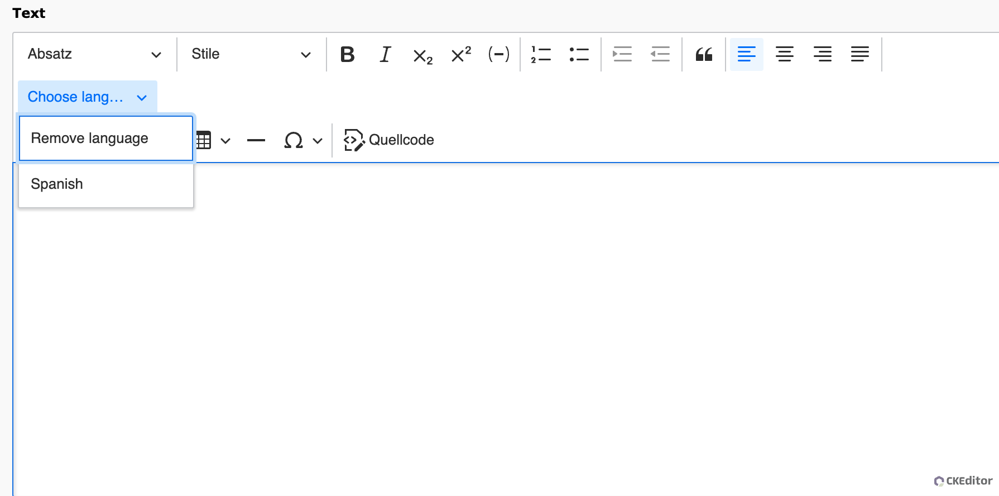
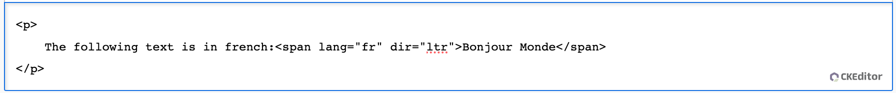

# CKEditor 5: wordbreak Plugin (TYPO3 Extension)

## Compatibility

TYPO3 12.4.0 - 12.4.99
CKEditor 5

## What does this extension do?

- The text part language feature lets you mark the language of text fragments. This way browsers and screen readers can correctly interpret parts written in different languages.
- Editors can update the language by selecting the language via the select box


## Screenshots

### CKEditor in TYPO3 backend: Lanugage selection menu



The languages are configerable in the "Resources/Public/JavaScript/textpartlanguageediting.js" via @gugler/textpartlanguageediting
Marking the text and selecting the language will add a span tag with the language configurations.

### CKEditor in TYPO3 backend: HTML code




## Installation

`composer req gugler/ckeditor-language`

The extension needs to be installed as any other extension of TYPO3 CMS.

Perform the following steps:

1. Load and install the extension
2. Extend your CKEditor configuration (see below)
3. (Optional) Set requirement in your extension if you want to override the selected languages (see below)

### CKEditor configuration

```
editor:
  config:
    importModules:
      - "@ckeditor/ckeditor-language"
```

### Override languages

Set requirement for gugler/ckeditor-language in your composer.json. This is needed so the plugins will be loaded in the correct order. Only the last declaration will be used!

```
"require": {
    ...
    "gugler/ckeditor-language": "*",
    ...
  },
```


Copy "Resources/Public/JavaScript/textpartlanguageediting.js" into your own extension and override it like this:

```
...
constructor(editor) {
    super(editor);
    // Text part language options are only used to ensure that the feature works by default.
    // In the real usage it should be reconfigured by a developer. We are not providing
    // translations for `title` properties on purpose, as it's only an example configuration.
    editor.config.define("language", {
      textPartLanguage: [
        { title: "<insertLanguageName>", languageCode: "<isnertLanguageCode>" },
        { title: "Arabic", languageCode: "ar" },
      ],
    });
  }
  ...
```

Then you need to override the JavasScriptModules:
Path: Configuration/JavaScriptModules.php

```

<?php

return [
  "dependencies" => ["backend"],
  "tags" => ["backend.form"],
  "imports" => [
    "@gugler/textpartlanguageediting" => "EXT:<extension_name>/<extension_path>/textpartlanguageediting.js",
  ],
];


```
